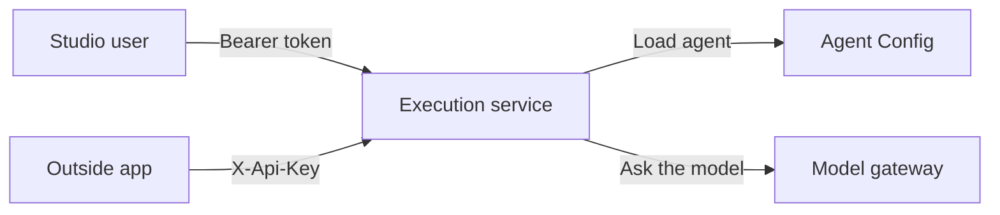
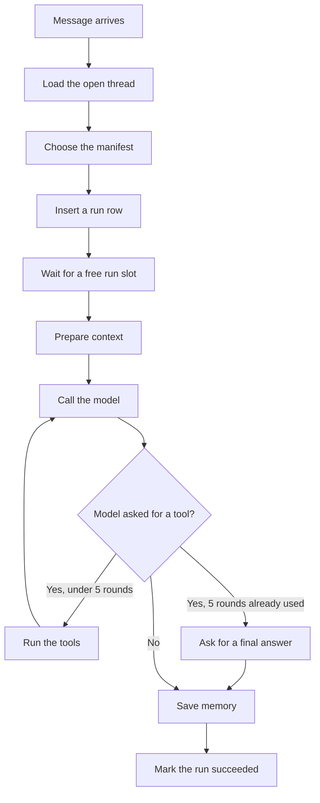

# Execution service, v1

This service runs an agent. It does not create the agent. Agent Config owns the name, prompt, model, tools, knowledge bases, groups, and memory settings. This service opens a conversation, accepts one message, calls the model, and stores the result.

The API listens on port **8765**. Run two processes:

- `agent-execution` answers HTTP calls.
- `agent-execution-worker` runs queued messages and cleans up old conversations.

The graph of steps is built once when a process starts. Every message walks that same graph with its own data.

## Words

| Word | Meaning |
|---|---|
| Agent | The definition in Agent Config. Many people can use one agent. |
| Thread | One conversation. Also called the session. |
| Run | One message on a thread, and the answer that came back. |
| Manifest | The copy of the agent used for a run: prompt, model, tools, knowledge bases, memory. |
| Deployment | A published door: a slug plus an API key. |
| Studio | A signed-in user, using a platform bearer token. |
| Published API | An outside app, using `X-Api-Key`. |

## The two doors



**Studio** calls `/api/v1/agents/{agentId}/...` with `Authorization: Bearer <platform token>`. The token is the same one the .NET services accept. Execution reads the user from the token. It then forwards that token to Agent Config, and Agent Config decides whether this user may see the agent.

**Published API** calls `/api/v1/invoke/{slug}/...` with `X-Api-Key`. There is no user token. The key must match that slug. Group checks are not repeated on this door. The agent must already be published before a deployment can be created.

## What a message does



Prepare context means:

1. Load memory for this thread, when memory is enabled.
2. Read attached file text, when file ids were sent.
3. Call the knowledge base, when a knowledge base is in Context mode.
4. Build one system prompt from the agent prompt, memory notes, recent history, knowledge-base text, and file text.
5. Send that prompt plus the new user message to the model.

The model reply is the `output` of the run. The steps taken are stored on the run. When storage is configured, the reply text is also saved as an output file.

## Threads

Create a thread before the first message. The thread id is the session id. Keep one thread per conversation.

| Kind | Who opens it | Manifest | How long it lives |
|---|---|---|---|
| Studio test | Bearer token, `executionType: TEST` | Live draft, read again on every message | 24 hours, then the worker marks it expired |
| Studio production | Bearer token, `executionType: PRODUCTION` | Snapshot taken when the thread opens | The default production policy, usually permanent |
| Published | API key, `POST /invoke/{slug}/threads` | Snapshot of the published agent at open time | The retention chosen when the deployment was created |

A production or published thread keeps the prompt, model, tools, and knowledge bases from the moment it was opened. A later edit in Agent Config shows up on a **test** thread. It does not change an already open production or published thread.

A closed or expired thread rejects new messages with `THREAD_CLOSED`.

Thread retention values: `TEMPORARY` (24 hours), `30_DAYS`, `90_DAYS`, `1_YEAR`, `PERMANENT`.

## Runs

A run is one message.

| Mode | How you ask | What you get |
|---|---|---|
| Normal | `stream: false`, `background: false` | The HTTP call waits, then returns the answer |
| Stream | `stream: true`, or header `Accept: text/event-stream` | Server-sent events. With no tools, tokens arrive as `token` events, then `done`. With tools, the graph finishes first and the result arrives on `done` |
| Background | `background: true` | The call returns immediately with status `QUEUED`. The worker runs it. Read it later with GET |

The same `idempotencyKey` on the same thread returns the original run. It does not run the model again. If that run is still going, the second call gets `409 RUN_IN_PROGRESS`.

A normal or streamed failure is stored as `FAILED` and is not tried again. A background failure is queued again until 3 attempts, then stored as `FAILED`.

Each API process allows **8** runs at the same time (`MAX_INFLIGHT_RUNS`). A ninth waits 2 seconds, then the call returns **429** `BUSY`. The worker process has its own limit of 8. Two API processes mean two separate limits.

## Who started the run

Every new run stores:

- `startedBy`: the username from the bearer token, or `api:{slug}` for a published call.
- `clientIp`: the client address. Through the studio proxy this is the first address in `X-Forwarded-For`. A direct call uses the connection address.

Older runs have these fields blank. The address is for tracing. It is not sent to the model.

Two browsers signed in as the same person show the same username. The address is what separates them when the machines are on different networks.

## Memory

Memory is a setting on the agent: enabled or not, a scope, optional instructions, and a retention value.

When memory is **off**, no earlier turns are loaded and nothing is saved.

When memory is **on**:

- `instructions` is added to the prompt as "Memory behavior notes."
- After a successful run, the user message and the reply are appended to a history row.
- The row is kept to the last **10 turn pairs** or **8,000 characters**, whichever is smaller. Older turns are dropped from storage and from the next prompt.
- The run result sets `truncatedForContextWindow` when that cut happened. That flag means the history limit was applied. It does not mean the model's token window was measured.

The scope picks the history row:

| Scope | History row |
|---|---|
| Session | This thread only. This is the normal case. |
| Agent | One shared row for every thread of this agent. |
| User | The key used today is still the thread id, so it behaves like Session. |
| Organization | Uses `orgId` on the run body together with the thread. Studio and the published message API do not send `orgId`. |

The memory `retention` value on the agent is stored and is not used to delete history. History goes away when the thread expires, or when the 10-pair / 8,000-character trim drops old turns.

Each message also fits the prompt into a character budget: `CONTEXT_WINDOW_TOKENS` minus `CONTEXT_OUTPUT_RESERVE_TOKENS`, counted as 4 characters per token (default 8,192 and 2,048). The system prompt and the new message stay. History, knowledge-base text, and file text are shortened until the prompt fits. A step `context.trimmed:history`, `context.trimmed:knowledge`, or `context.trimmed:files` records what was cut. If the system prompt plus the new message alone exceed the budget, the run fails with `CONTEXT_TOO_LARGE`.

## Knowledge bases

A knowledge base on the agent is either **Context** or **Tool**.

**Context.** Before the model is called, execution calls the RAG ask service: `POST {RAG_ASK_BASE_URL}/ask?kb={id}` with `{ "question": "<user message>" }`. Evidence lines are pasted into the prompt. If the RAG service returns an HTTP error or cannot be reached, the call becomes `RAG_UNAVAILABLE`. The prompt tells the model to say that something went wrong and not to invent sources. The run step is `rag.unavailable:{name}:{code}`. The model still writes the reply.

**Tool.** The model is given a function named from the knowledge base. The model decides when to call it. The call hits the same RAG ask service. If that call fails, the model receives a short unavailable result and is asked to tell the user something went wrong. The run step is `tool.failed:{name}:{code}`. The run still finishes with the model's reply.

`RAG_CONFIG_BASE_URL` is configured and is not called on the message path.

An empty RAG URL is treated as `http://127.0.0.1:9`, so a missing setting fails the call instead of talking to a random host.

## Tools

Tools on the agent are sent to the model as functions. The model may call them. Execution looks up the tool in Tools Config and POSTs the arguments to the tool's invoke URL. The tool result is given back to the model. This can repeat up to **5** rounds. On the fifth round the model is asked for a final answer with no further tools.

A tool call that raises a service error is handed back to the model as unavailable, with a step `tool.failed:{name}:{code}`. A tool call that is missing its name still fails the run.

Published calls have no user bearer token. Outbound calls to Agent Config, Tools, and RAG then use the service login (`AUTH_SERVICE_USERNAME` and `AUTH_SERVICE_PASSWORD`) when those are set.

## Files

Studio can upload a file through the storage service, then send the artifact id on the run as `inputArtifactIds`. Execution reads the text with the storage internal key, up to **12,000 characters**, and places it in the prompt. The next message does not see the file unless the id is sent again.

The published API accepts `inputArtifactIds`, and it has no upload route of its own. An API-key caller cannot upload a file with only that key.

When `PERSIST_OUTPUT_ARTIFACTS` is true and storage is configured, the reply text is saved as an output artifact. If storage is not configured, the reply is still returned on the run. It is just not copied to storage.

## Auth

Studio routes require a bearer token. Execution base64-decodes the JWT payload. It reads the username from `unique_name`, `preferred_username`, `username`, `name`, or `tokenkey`. It rejects a token whose `exp` is in the past. It does not call `GET /api/v1/auth/me`. It does not check the token signature and it does not check the Redis session. Agent Config still enforces groups when the token is forwarded.

`AUTH_REQUIRED_PERMISSIONS` is an optional comma-separated list. When it is set, the token must contain those permission codes or the call is `403`. Leave it empty to accept any unexpired token that can be read.

Published routes require `X-Api-Key`. The key is hashed with SHA-256 and matched to the deployment. The raw key is returned only when the deployment is created.

## Deployments

A signed-in user creates one:

`POST /api/v1/agents/{agentId}/deployments`

```json
{ "slug": "claims-bot", "retentionPolicy": "PERMANENT" }
```

The agent must be published. `slug` is 2–63 characters of lowercase letters, numbers, and hyphens. The response includes `apiKey` once. Listing deployments later does not show the key again.

## Background worker

```mermaid
flowchart TD
  poll[Poll every second] --> fail[Mark sync runs whose lease expired as FAILED]
  fail --> claim[Claim the oldest queued background run]
  claim -->|Found one| graph[Run the same graph]
  claim -->|None| cleanup[Every 5 minutes, expire old threads]
  graph --> poll
  cleanup --> poll
```

A claimed run holds a lease of 180 seconds. Heartbeats extend it. If the worker dies, another worker can claim the run after the lease expires, up to 3 attempts.

Expiring a thread deletes its storage files, deletes the conversation history for that thread, and sets the thread status to `EXPIRED`.

## Errors you will see

| Code | When |
|---|---|
| 401 `UNAUTHORIZED` | Missing or unreadable bearer token, expired token, or bad API key |
| 403 `FORBIDDEN` | Token is missing a permission listed in `AUTH_REQUIRED_PERMISSIONS` |
| 404 `NOT_FOUND` | Thread, run, or deployment does not belong to this agent or slug |
| 409 `THREAD_CLOSED` | Thread is expired or otherwise not open |
| 409 `RUN_IN_PROGRESS` | The same idempotency key is already running |
| 409 `CONFLICT` | A duplicate idempotency key raced on insert |
| 422 `VALIDATION_FAILED` | Body does not match the schema, or the slug is illegal |
| 429 `BUSY` | This process already has 8 runs in flight |
| 502 `LLM_ERROR` | The model gateway failed |
| 503 `NOT_READY` | Database is down on the ready check |
| 500 `INTERNAL_ERROR` | Anything else unexpected |

Every error body is `{ "code", "message", "requestId" }`. Send `X-Request-ID` to set that id. The access log records method, path, status, and duration. It does not record the user message, the bearer token, or the API key.

## API

Base path: `/api/v1`.

Health, no auth:

- `GET /health/live`
- `GET /health/ready`

Studio, bearer token:

- `POST /agents/{agentId}/threads` with `{ "executionType": "TEST" }` or `"PRODUCTION"`
- `GET /agents/{agentId}/threads`
- `GET /agents/{agentId}/threads/{threadId}`
- `POST /agents/{agentId}/threads/{threadId}/runs` with `{ "input", "inputArtifactIds", "stream", "background", "idempotencyKey" }`
- `GET /agents/{agentId}/threads/{threadId}/runs`
- `GET /agents/{agentId}/threads/{threadId}/runs/{runId}`
- `POST /agents/{agentId}/deployments`
- `GET /agents/{agentId}/deployments`

The same thread routes also exist under `/agents/{agentId}/executions`.

Published, `X-Api-Key`:

- `POST /agents/{agentId}/execute` with `X-Api-Key` and `{ "input", "threadId" }`. This is the common published call. The agent id is the only thing that changes in the path. Omit `threadId` to open a new chat. Send the returned `threadId` on the next message to continue that chat. A second chat is a second thread id. The call fails when the agent is not published.
- `POST /invoke/{slug}/threads`
- `POST /invoke/{slug}/threads/{threadId}/messages` with `{ "input", "threadId", "inputArtifactIds", "stream", "background", "idempotencyKey" }`
- `POST /invoke/{slug}` for one shot. Omit `threadId` to open a new thread for that call only.
- `GET /invoke/{slug}/runs/{runId}`

Interactive docs are at `/docs`. Studio routes ask for a bearer value on each call. Invoke routes ask for the API key header.

## Scenarios

### Studio test, plain message

You are signed in. You open a test thread and send "Hello".

The service checks the token, loads the live draft, inserts a run with your username and address, and calls the model with the system prompt and "Hello". Memory, if enabled, includes the recent turns of this thread only. The answer is stored on the run and returned.

### Same person, two PCs

Each PC has its own token. Both can use the agent.

If both send on the **same** thread, both runs execute together, both read the history from before either finished, and both replies are written to that one thread. The activity row shows the same username and, when the networks differ, two addresses.

If each PC clicks **New test**, each gets a new thread id. Those conversations stay separate.

### Studio production

You open a production thread. The manifest is copied onto the thread. You change the prompt in Agent Config. The next message on this thread still uses the old copy. A new test thread sees the new prompt.

### File on a studio message

You upload the file in the studio, then send the message with that artifact id. The file text, up to 12,000 characters, is added to this prompt only. The following message does not include the file unless you send the id again.

### Published app, one user

The app saved `slug` and `apiKey`. It opens a thread once per end user and stores `threadId`.

Each message is `POST /invoke/{slug}/threads/{threadId}/messages` with `X-Api-Key` and `{ "input": "..." }`. The answer is `output`. The next message on that thread sees the earlier turns, up to the history limit. Another end user needs another thread id.

### Published one-shot

`POST /invoke/{slug}` with only `input` and no `threadId` opens a new thread, answers, and that thread is not reused unless the caller stores the returned `threadId` and sends it next time.

### Same message delivered twice

The app sends `idempotencyKey`. A retry with the same key and the same thread returns the first result. A different thread is a different conversation, even with the same key.

### Streaming

The caller sets `stream: true`. With no tools, text arrives as events and the run is saved at the end. With tools, the caller waits for the `done` event. `background: true` does not stream.

### Background

The caller sets `background: true`. The response is a queued run. The worker picks it up and runs the same graph. The caller polls `GET` on the run id until status is `SUCCEEDED` or `FAILED`.

### Too many messages at once

Eight runs are already inside this API process. The next one waits two seconds. If a slot is still not free, the caller gets `429 BUSY` and can retry. Other processes are unaffected.

### Knowledge base or tool is down

A Context-mode lookup that cannot be reached is recorded as `rag.unavailable:...`. A tool call that fails is recorded as `tool.failed:...`. In both cases the model still writes the sentence the user sees, such as that something went wrong, and the run succeeds. The technical reason stays in the step and the log. If the model itself is down, the run is `FAILED`. A normal call is not queued again. A background call is retried up to 3 times.

### Memory off

The model sees the system prompt, any knowledge-base text, any file text, and the new message. It does not see earlier turns, and this turn is not saved for later.

### Memory on, long conversation

Turns older than the last 10 pairs, or beyond 8,000 characters, are dropped. The model sees the newest remaining turns. The system prompt and a large knowledge-base result can still make the call fail, because those are outside the history limit.

### Agent memory scope

Every thread of this agent reads and writes one history. User A's message can appear in User B's next prompt. Session scope avoids that.

### Bad or expired token

A missing token, a token that is not a readable JWT, or a token past `exp` returns `401`. A published call with the wrong key returns `401`.

### Agent not published

Creating a deployment, or opening a production thread, fails when Agent Config says the agent is not published.

### Database down

`GET /health/live` can still return ok. `GET /health/ready` returns `503`. Message calls fail because threads and runs are stored in Postgres.

## Settings that change behavior

Copy `execution-service/.env.example` to `.env`. The important ones:

| Setting | Default | Role |
|---|---|---|
| `PORT` | `8765` | HTTP port |
| `EXECUTION_DATABASE_URL` | required | Threads, runs, deployments, history |
| `AGENT_CONFIG_BASE_URL` | empty, then a closed local port | Where the agent is loaded |
| `TOOLS_CONFIG_BASE_URL` | empty | Tool and model lookup |
| `RAG_ASK_BASE_URL` | empty | Knowledge-base questions |
| `BIFROST_GATEWAY_BASE_URL` | empty | Model gateway. Empty plus `LLM_GATEWAY_MOCK=true` returns a fake answer |
| `STORAGE_SERVICE_BASE_URL` and `STORAGE_INTERNAL_API_KEY` | empty | File read and output save. Both must be set |
| `AUTH_SERVICE_USERNAME` and `AUTH_SERVICE_PASSWORD` | empty | Service login for calls that have no user token |
| `AUTH_REQUIRED_PERMISSIONS` | empty | Optional permission gate for studio routes |
| `CONVERSATION_MAX_TURN_PAIRS` | `10` | History size |
| `CONVERSATION_MAX_CHARS` | `8000` | History size |
| `MAX_TOOL_ROUNDS` | `5` | Tool loop cap |
| `MAX_INFLIGHT_RUNS` | `8` | Parallel runs per process |
| `ARTIFACT_PROMPT_MAX_CHARS` | `12000` | File text in the prompt |
| `TEST_THREAD_TTL_HOURS` | `24` | Test thread lifetime |
| `SKIP_MODEL_REGISTRY_LOOKUP` | `true` | Use the model name already on the agent |
| `LOG_FORMAT` | `text` | Set `json` in production |

## What this version does not do

- The context budget is a setting (`CONTEXT_WINDOW_TOKENS`), not a field read from the model record. Set it to the model's published window.
- It does not share memory by real user id. User scope follows the thread.
- It does not accept a file upload with only an API key.
- It does not check the platform token signature or the Redis session.
- If the model itself is down, there is no separate fallback sentence. The run fails.
